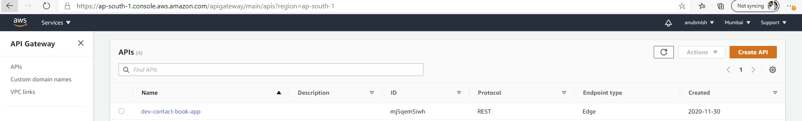
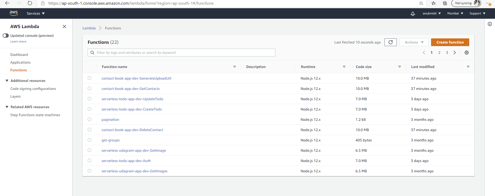

# Contact Book App

This is a contact book application. This app can be used personally or commercially. This application has fields like name, address and contact number. This app allows users to add, delete, fetch contacts from dynamoDB through the front end. Apart from this it has additional APIs on backend to update and fetch contact by ID.
Functionality:
1. Add contact
2. Delete contact
3. fetch all contacts
4. Add image for contact image through edit contact which goes to S3 bucket
5. Login
6. Logout

Additional APIs:
1. fetech contact by contact ID
2. update contact

These APIs can be run through postman from the attached collection.

# API endpoint

https://mj5qem5iwh.execute-api.ap-south-1.amazonaws.com/dev

# Home Page

# Frontend

Frontend is built on react. Just need to put apiID i.e deployed serverless backed id in config.ts and we are good to go run frontend from the following commands:

1. cd client
2. npm install
3. npm run start
4. open localhost:3000 in browser

# Backend

Backend is built on serverless. You may use the following commands to deploy backend:

1. cd backend
2. npm install
3. sls deploy -v --aws-profile serverless

Following are the screenshot of AWS deployed backend:

# Postman collection

An alternative way to test your API, you can use the Postman collection that contains sample requests. You can find a Postman collection in this project. Use the attached postman collection to test the APIs.
